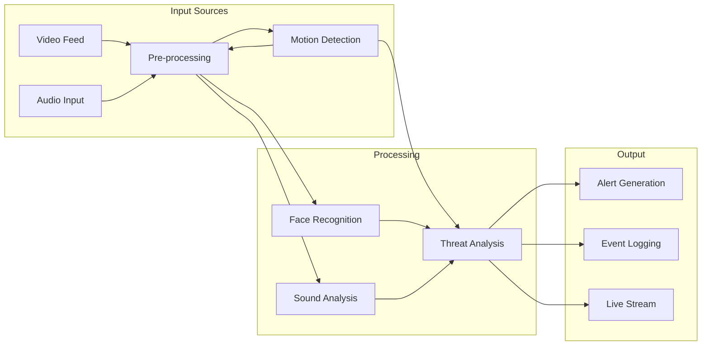

```mermaid
graph LR
    subgraph Input Sources
        Video[Video Feed] --> PreProcess[Pre-processing]
        Motion[Motion Sensor] --> PreProcess
        Audio[Audio Input] --> PreProcess
    end
    
    subgraph Processing
        PreProcess --> Motion[Motion Detection]
        PreProcess --> Face[Face Recognition]
        PreProcess --> Sound[Sound Analysis]
        
        Motion --> Analysis[Threat Analysis]
        Face --> Analysis
        Sound --> Analysis
    end
    
    subgraph Output
        Analysis --> Alert[Alert Generation]
        Analysis --> Log[Event Logging]
        Analysis --> Stream[Live Stream]
    end
```
