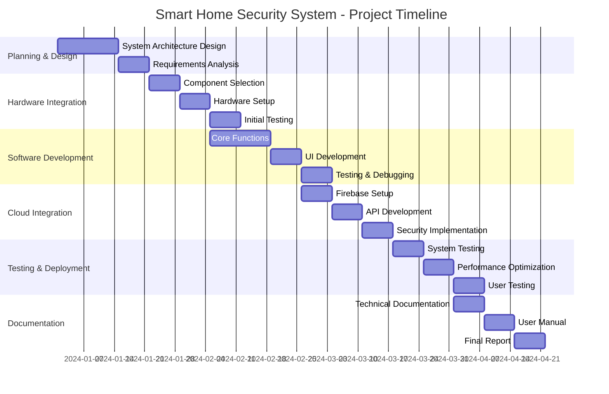

```mermaid
gantt
    title Smart Home Security System - Project Timeline
    dateFormat  YYYY-MM-DD
    
    section Planning & Design
    System Architecture Design    :des1, 2024-01-01, 14d
    Requirements Analysis        :des2, after des1, 7d
    
    section Hardware Integration
    Component Selection         :hw1, after des2, 7d
    Hardware Setup             :hw2, after hw1, 7d
    Initial Testing            :hw3, after hw2, 7d
    
    section Software Development
    Core Functions             :sw1, after hw2, 14d
    UI Development            :sw2, after sw1, 7d
    Testing & Debugging       :sw3, after sw2, 7d
    
    section Cloud Integration
    Firebase Setup            :cloud1, after sw2, 7d
    API Development          :cloud2, after cloud1, 7d
    Security Implementation  :cloud3, after cloud2, 7d
    
    section Testing & Deployment
    System Testing           :test1, after cloud3, 7d
    Performance Optimization :test2, after test1, 7d
    User Testing            :test3, after test2, 7d
    
    section Documentation
    Technical Documentation  :doc1, after test2, 7d
    User Manual             :doc2, after doc1, 7d
    Final Report            :doc3, after doc2, 7d
```
