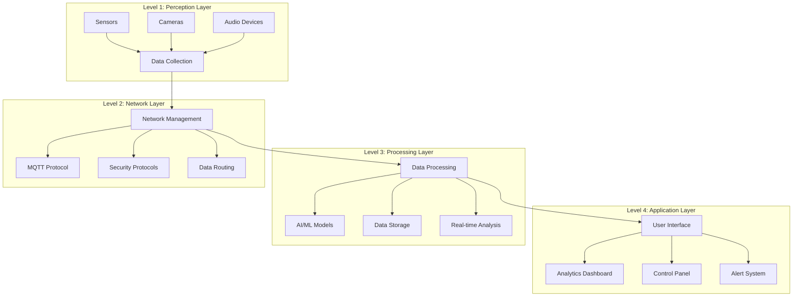

```mermaid
graph TB
    subgraph "Level 4: Application Layer"
        UI[User Interface] --> Analytics[Analytics Dashboard]
        UI --> Control[Control Panel]
        UI --> Notifications[Alert System]
    end
    
    subgraph "Level 3: Processing Layer"
        Processing[Data Processing] --> AI[AI/ML Models]
        Processing --> Storage[Data Storage]
        Processing --> RealTime[Real-time Analysis]
    end
    
    subgraph "Level 2: Network Layer"
        Network[Network Management] --> Protocol[MQTT Protocol]
        Network --> Security[Security Protocols]
        Network --> Routing[Data Routing]
    end
    
    subgraph "Level 1: Perception Layer"
        Sensors[Sensors] --> DataCollection[Data Collection]
        Camera[Cameras] --> DataCollection
        Audio[Audio Devices] --> DataCollection
    end
    
    DataCollection --> Network
    Network --> Processing
    Processing --> UI
```
