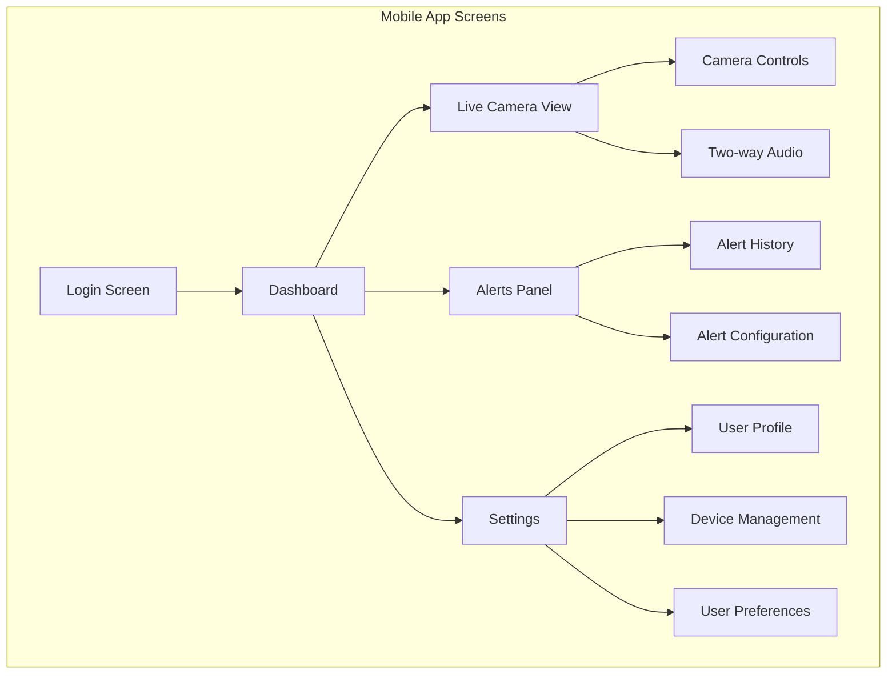

```mermaid
graph TB
    subgraph Mobile App Screens
        Login[Login Screen] --> Dashboard[Dashboard]
        Dashboard --> LiveView[Live Camera View]
        Dashboard --> Alerts[Alerts Panel]
        Dashboard --> Settings[Settings]
        
        LiveView --> Controls[Camera Controls]
        LiveView --> TwoWay[Two-way Audio]
        
        Alerts --> History[Alert History]
        Alerts --> Config[Alert Configuration]
        
        Settings --> Profile[User Profile]
        Settings --> Devices[Device Management]
        Settings --> Preferences[User Preferences]
    end
```
