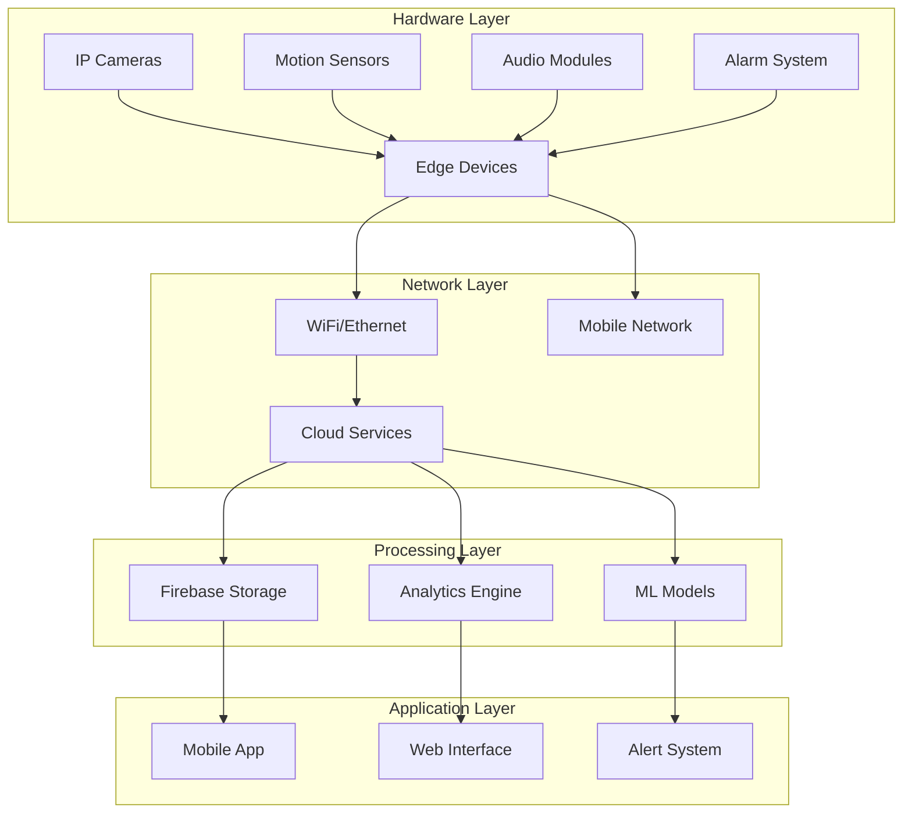

```mermaid
graph TB
    subgraph Hardware Layer
        IP[IP Cameras] --> Edge[Edge Devices]
        Sensors[Motion Sensors] --> Edge
        Audio[Audio Modules] --> Edge
        Alarm[Alarm System] --> Edge
    end
    
    subgraph Network Layer
        Edge --> WiFi[WiFi/Ethernet]
        WiFi --> Cloud[Cloud Services]
        Edge --> Mobile[Mobile Network]
    end
    
    subgraph Processing Layer
        Cloud --> Storage[Firebase Storage]
        Cloud --> Analytics[Analytics Engine]
        Cloud --> ML[ML Models]
    end
    
    subgraph Application Layer
        Storage --> App[Mobile App]
        Analytics --> Web[Web Interface]
        ML --> Alerts[Alert System]
    end
```
